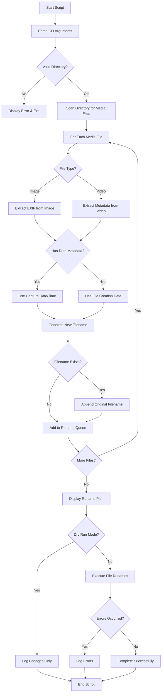

# Media File Renamer - Architecture & Workflow

## Overview
Cross-platform Python script that renames photos and videos based on their capture date/time from EXIF metadata, with fallback to file system timestamps.

## Target Format
```
YYYY-MM-DD_HHMMSS_OriginalName.ext
Example: 2024-12-01_143045_IMG_1234.jpg
```

## Workflow Diagram



## Component Architecture

### Core Modules

1. **CLI Parser** (`argparse`)
   - Directory path
   - Dry-run flag
   - Recursive mode
   - Verbosity level
   - Output format options

2. **Metadata Extractor**
   - Image handler using Pillow
   - Video handler using ffmpeg/pymediainfo
   - Fallback to filesystem dates

3. **Filename Generator**
   - Date/time formatter
   - Collision resolver
   - Original name preserver

4. **File Renamer**
   - Safe rename with validation
   - Error handling and rollback
   - Progress reporting

5. **Logger**
   - Multiple verbosity levels
   - Structured output
   - Error tracking

## Supported File Formats

### Images
- JPEG (.jpg, .jpeg)
- PNG (.png)
- HEIC/HEIF (.heic, .heif)
- TIFF (.tiff, .tif)
- RAW formats (.cr2, .nef, .arw, .dng)

### Videos
- MP4 (.mp4)
- MOV (.mov)
- AVI (.avi)
- MKV (.mkv)
- M4V (.m4v)
- WMV (.wmv)
- FLV (.flv)

## Error Handling Strategy

1. **Read Errors**: Log and skip file
2. **Metadata Missing**: Fall back to file dates
3. **Rename Conflicts**: Append original filename
4. **Permission Errors**: Log and continue
5. **Invalid Paths**: Validate before processing

## Cross-Platform Considerations

- Use `pathlib.Path` for all path operations
- Handle Windows/Linux path separators
- Test file permissions before rename
- Use platform-agnostic date formatting
- Handle timezone differences appropriately

## Usage Examples

```bash
# Dry run to preview changes
python rename_media.py /path/to/photos --dry-run

# Rename with verbose logging
python rename_media.py /path/to/photos -v

# Recursive rename with progress
python rename_media.py /path/to/media --recursive --progress

# Non-recursive, quiet mode
python rename_media.py /path/to/folder -q
```

## Dependencies

- **Pillow**: Image EXIF extraction
- **pymediainfo** or **ffmpeg-python**: Video metadata
- **argparse**: CLI interface (built-in)
- **pathlib**: Path handling (built-in)
- **logging**: Logging system (built-in)
- **datetime**: Date/time operations (built-in)